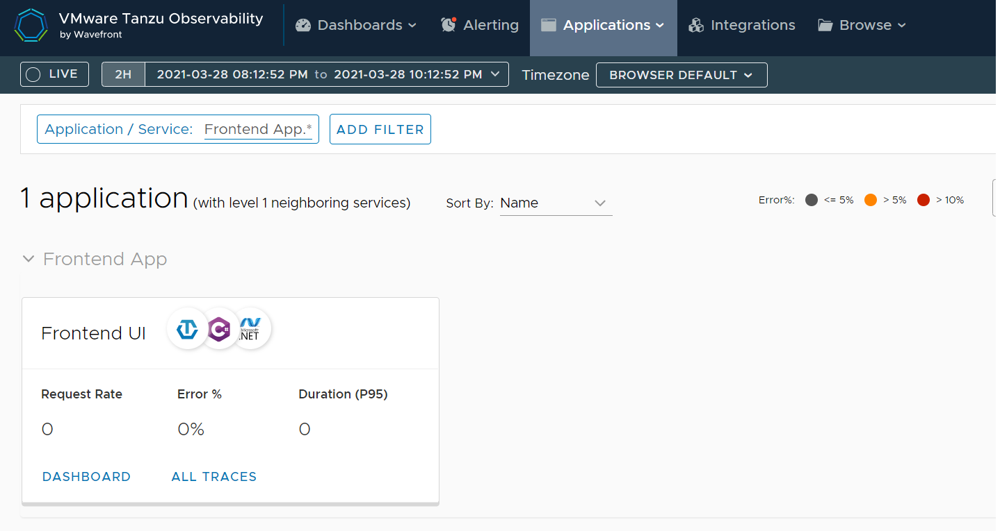

# .NET Wavefront SDK Tanzu Application Service Integration

## Overview

In this repository we setup a simple application that will be instrumented using the [Wavefront ASP.NET Core SDK](https://github.com/wavefrontHQ/wavefront-aspnetcore-sdk-csharp) to allow the applications to send metrics and traces to Wavefront.



1. Create a new workspace directory and navigate to that directory

   ```bash
   mkdir <workspace name>
   cd <workspace name>
   ```

2. Create a new project named frontend.

   ```cs
    dotnet new mvc --name frontend
   ```

3. Add the [Wavefront.AspNetCore.SDK.CSharp](https://www.nuget.org/packages/Wavefront.AspNetCore.SDK.CSharp/) nuget package:

   ```bash
   dotnet add package Wavefront.AspNetCore.SDK.CSharp
   ```

   Create a file named `WavefrontExtensions.cs` with the following contents.  Copy the file to root of the project.  This file includes SDK code that allows us to connect to a Wavefront Proxy or to Wavefront with Direct Ingestion.

   ```cs
   using Microsoft.Extensions.Configuration;
   using Microsoft.Extensions.DependencyInjection;

   using Wavefront.AspNetCore.SDK.CSharp.Common;
   using Wavefront.OpenTracing.SDK.CSharp;
   using Wavefront.OpenTracing.SDK.CSharp.Reporting;
   using Wavefront.SDK.CSharp.Common.Application;
   using Wavefront.SDK.CSharp.Proxy;

   using OpenTracing;

   namespace wavefront_sdk
   {
      public static class SteeltoeWavefrontProxyExtensions
      {
         public class WavefrontProxyOptions
         {
               public WavefrontProxyOptions()
               {
                  Port = 2878;
                  DistributionPort = 2878;
                  TracingPort = 30000;
                  ReportingIntervalSeconds = 30;
                  FlushIntervalSeconds = 2;
               }

               public const string WavefrontProxy = "wavefront-proxy";
               public string Hostname { get; set; }
               public int Port { get; set; }
               public int DistributionPort { get; set; }
               public int TracingPort { get; set; }
               public string Application { get; set; }
               public string Service { get; set; }
               public string Cluster { get; set; }
               public string Shard { get; set; }
               public string Source {get; set;}
               public int ReportingIntervalSeconds {get; set;}
               public int FlushIntervalSeconds { get; set; }
         }

         public static IServiceCollection AddSteeltoeWavefrontProxy(this IServiceCollection services, IConfiguration configuration)
         {
               var waveFrontProxyConfiguration = 
                  configuration.GetSection(WavefrontProxyOptions.WavefrontProxy).Get<WavefrontProxyOptions>();

               var wfProxyClientBuilder = new WavefrontProxyClient.Builder(waveFrontProxyConfiguration.Hostname);
               wfProxyClientBuilder.MetricsPort(waveFrontProxyConfiguration.Port);
               wfProxyClientBuilder.DistributionPort(waveFrontProxyConfiguration.DistributionPort);
               wfProxyClientBuilder.TracingPort(waveFrontProxyConfiguration.TracingPort);
               wfProxyClientBuilder.FlushIntervalSeconds(waveFrontProxyConfiguration.TracingPort);
               var wavefrontSender = wfProxyClientBuilder.Build();

               var applicationTags = new ApplicationTags.Builder(waveFrontProxyConfiguration.Application, waveFrontProxyConfiguration.Service)
               .Cluster(waveFrontProxyConfiguration.Cluster)
               .Shard(waveFrontProxyConfiguration.Shard)
               .Build();

               var wfAspNetCoreReporter = new WavefrontAspNetCoreReporter.Builder(applicationTags)
                  .WithSource(waveFrontProxyConfiguration.Source)
                  .ReportingIntervalSeconds(waveFrontProxyConfiguration.ReportingIntervalSeconds)
                  .Build(wavefrontSender);

               System.Console.WriteLine(wfAspNetCoreReporter);

               var wavefrontSpanReporter = new WavefrontSpanReporter.Builder()
               .Build(wavefrontSender);

               ITracer tracer = new WavefrontTracer.Builder(wavefrontSpanReporter, applicationTags).Build();

               services.AddWavefrontForMvc(wfAspNetCoreReporter, tracer);

               return services;
         }
      }
   }
   ```

4. Make the following changes in `Startup.cs`
   1. Add the following using statement:

      ```cs
      using wavefront_sdk;
      ```

   2. Add the following line at the end of the  `ConfigureServices` method:

      ```cs
      services.AddWavefrontProxy(Configuration);
      ```

5. Add configuration for the respective project:

   1. frontend

      ```json
      "wavefront-proxy": {
         "Hostname": "IP/HOST Name of Your WavefrontP Proxy",
         "Application": "Frontend App", 
         "Service": "Frontend UI"
      }
      ```

6. Build the applications:

   ```bash
   dotnet publish -o .\publish
   ```

7. Create a Yaml file called manifest.yml with the following contents:

   ```yml
   applications:
   - name: frontend
   path: .\publish
   buildpacks:
   - https://github.com/cloudfoundry/dotnet-core-buildpack
   services:
   - wavefront-proxy
   env:
      ASPNETCORE_ENVIRONMENT: Development
   ```

8. Push our application

   ```bash
   cf push
   ```
